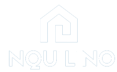

  

## Sobre o Inquilino

O Inquilino é uma plataforma inovadora que facilita a compra, venda e aluguel de imóveis. Com uma interface amigável e recursos poderosos, nossa plataforma torna o processo de encontrar a casa dos seus sonhos ou listar sua propriedade para venda ou aluguel mais simples do que nunca.

## Recursos Principais

- Pesquisa avançada de imóveis
- Listagens detalhadas de propriedades
- Avaliações e classificações de propriedades
- Mensagens diretas entre compradores e vendedores
- E muito mais!

## Como Contribuir

Nós adoramos contribuições da comunidade! Se você deseja colaborar no desenvolvimento do Inquilino, siga estas etapas:

1. Faça um fork deste repositório.
2. Crie uma nova branch com um nome descritivo da sua contribuição.
3. Faça as mudanças e melhorias necessárias.
4. Envie um pull request descrevendo suas alterações e por que elas são importantes.

Nossa equipe revisará suas contribuições e responderá o mais rápido possível.

## Contato

Para entrar em contato com a equipe de desenvolvimento do Inquilino ou para obter suporte, envie um email para [busilancer@gmail.com](mailto:busilancer@gmail.com).

Agradecemos por escolher o Inquilino para suas necessidades de compra, venda e aluguel de imóveis!
